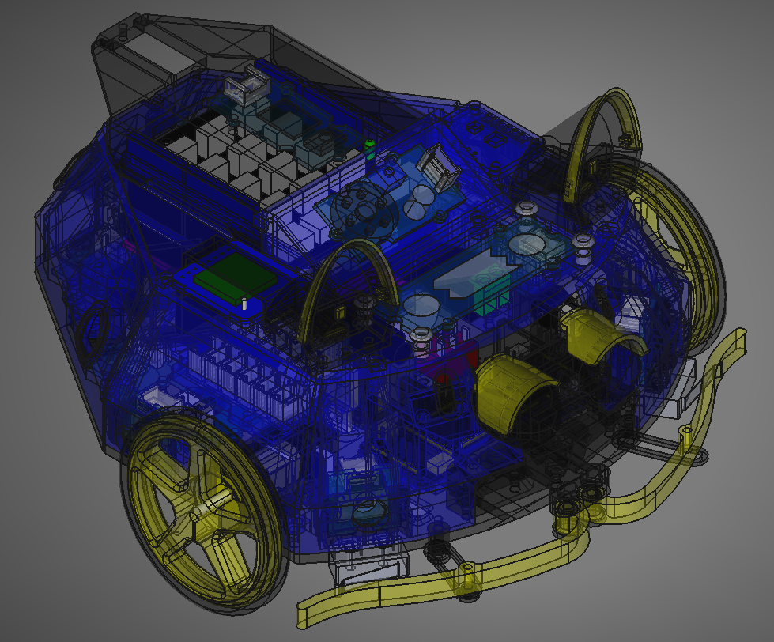

# PB3D-CAD
Computer Aided Design files for PB3D the 3D printed pet robot. PB3D is designed in FreeCAD and printed on a Prusa MINI+. The FreeCAD files can be found in the design folder with the overarching assembly (PB3D_Assembly.FCStd) built using the A2Plus workbench. PB3D looks like this:

||
|:--:|
|*Assembly for PB3D the 3D printed pet robot.* |

## Code
The code for running PB3D can be found here: https://github.com/ScepticalRabbit/PB3D

## Parts List
Coming soon.

 
